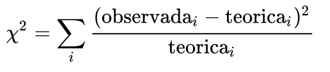
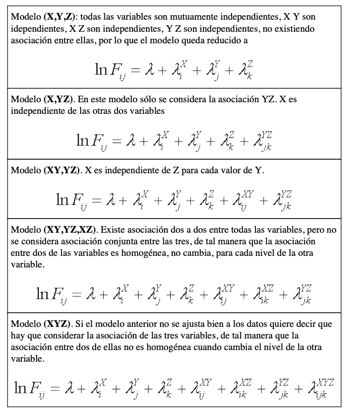
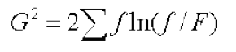

# Tablas de Contingencia

Cuando hay dos o más variables, cada una con dos o más categorías, los recuentos forman una tabla de contingencia donde las observaciones se clasifican de forma cruzada por las variables categóricas.

Las variables de contingencia no distinguen específicamente las variables de respuesta y predictoras, aunque tal predicción puede ser importante en la interpretación y construcción de modelos.

Un estadístico fundamental para el análisis de datos por  categorías es el estadístico chi cuadrado, también llamado estadístico de Pearson r2, que se usa comunmente para comparar frecuencias observadas y teoricas (esperadas) e categorias.

donde O y e son las frecuencias observadas y esperadas en cada categoria o combimnación y la sumatoria es sobre todas las categorias. Los grados libertadson en función del número de categorias menos 1. Chi2 basicamente mide la diferencia entre los valores observados y esperados. Tiene un valor de 0 cuando son los mismos

Referencia
https://www.cambridge.org/highereducation/books/experimental-design-and-data-analysis-for-biologists/BAF276114278FF40A7ED1B0FE77D691A#overview

Denominamos variables cualitativas a aquellas cuyo resultado es un valor o categoría de entre un conjunto finito de respuestas posibles. El sexo, el estado civil o el grupo sanguíneo son ejemplos de variables cualitativas. Cuando se analizan variables cualitativas es habitual representar en tablas las frecuencias de casos observados para cada una de las diferentes categorías de las variables, las cuales se denominan tablas de contingencia.

El razonamiento para contrastar si existe o no asociación entre dos variables cualitativas se basa en calcular cuál serían los valores de frecuencia esperados para cada una de las celdas en el caso de que efectivamente las variables fuesen independientes, y compararlos con los valores realmente observados. Si no existe mucha diferencia entre ambos, no hay razones para dudar de que las variables sean independientes.

Si las variables son independientes esta proporción debiera mantenerse (al menos de forma aproximada) en cada nivel de estudios.

 La asociación entre dos variables cualitativas resulta ser espuria cuando se considera los valores de una tercera variable, situación que se conoce como **Paradoja de Simpson** y que también se puede dar en variables cuantitativas.

Para analizar este tipo de tablas multidimensionales utilizaremos los modelos log−lineales planteados más arriba. Para tres variables X,Y,Z podemos ajustar a nuestros datos diferentes modelos:

## Selección de modelo

Procederemos a ajustar diferentes modelos a nuestros datos y ver cuál se adecua mejor a los valores observados.
Para contrastar dos modelos diferentes se utiliza el estadístico denominado cociente de verosimilitud (likelihood ratio), que se calcula como:

donde f es la frecuencia observada y F la frecuencia esperada según el modelo. Este estadístico se distribuye según una chi2 en la hipótesis de que el modelo es correcto, con grados de libertad que dependen de los parámetros utilizados para ajustar el modelo. En la salida de los programa de estadística ingleses se suele presentar también como **Deviance (desviación respecto al modelo observado, también conocido como modelo saturado**, porque en él se incluyen todos los términos de asociación posibles y se ajusta por tanto perfectamente a los datos observados). Valores elevados de G2 reflejan un mal ajuste del modelo a los datos, lo que corresponderá a un valor de probabilidad bajo.

Referencias :

https://www.alceingenieria.net/bioestadistica/loglinear.pdf

# Hipotesis de mi proyecto

Tabla de 3 dimensiones

La cobertura del arbol relacionada con su condición de reforestado en la salud de los arboles .
Arboles cubiertos dependen de si fueron reforestados

Tablas de dos dimensiones
La salud del arbol depende de si fueron reforestados

La salud del arbol depende de si estan cubiertos
